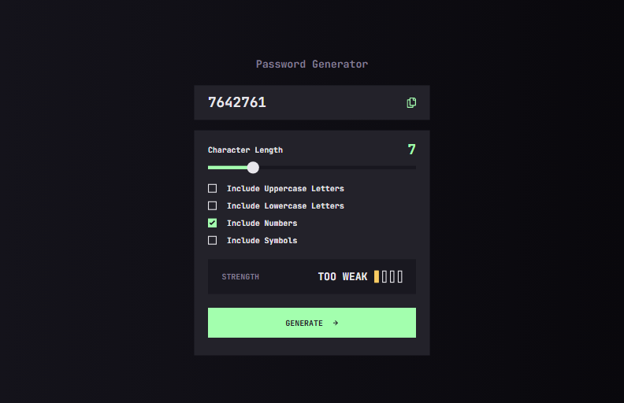

# Frontend Mentor - Password generator app solution

This is a solution to the [Password generator app challenge on Frontend Mentor](https://www.frontendmentor.io/challenges/password-generator-app-Mr8CLycqjh). Frontend Mentor challenges help you improve your coding skills by building realistic projects.

## Table of contents

- [Overview](#overview)
  - [The challenge](#the-challenge)
  - [Screenshot](#screenshot)
  - [Links](#links)
- [My process](#my-process)
  - [Built with](#built-with)
  - [What I learned](#what-i-learned)
  - [Continued development](#continued-development)
- [Author](#author)

## Overview

### The challenge

Users should be able to:

- Generate a password based on the selected inclusion options
- Copy the generated password to the computer's clipboard
- See a strength rating for their generated password
- View the optimal layout for the interface depending on their device's screen size
- See hover and focus states for all interactive elements on the page

### Screenshot



### Links

- Solution URL: [GitHub](https://github.com/artemkotko14/password-generator-app)
- Live Site URL: [Webpage](https://password-generator-app-virid-nine.vercel.app/)

## My process

### Built with

- Semantic HTML5 markup
- SASS
- Flexbox
- JavaScript

### What I learned

1. tabindex="0" makes an element focusable and includes it in the natural tab order for keyboard navigation.

```html

```

2.  A way to change any color to white with css:

```css
filter: brightness(0) invert(1);
```

- brightness(0): This makes the entire image completely black by removing all brightness.
- invert(1): This inverts the colors, turning black pixels into white.
  Together, these two functions convert any dark-colored (usually black) icon into pure white on hover.

3. A way to shuffle characters of a string

```js
newPassword = newPassword
  .split("")
  .sort(() => Math.random() - 0.5)
  .join("");
```

4. Function to copy text to clipboard

```js
async function copyPassword() {
  const passwordText = password.textContent;
  try {
    await navigator.clipboard.writeText(passwordText);
    console.log("Password copied to clipboard!");
  } catch (err) {
    console.error("Failed to copy:", err);
  }
}
```

### Continued development

In future projects I would like to work more with asynchronous functions to understand them better

## Author

- Github - [Artem Kotko](https://github.com/artemkotko14)
- Frontend Mentor - [@artemkotko14](https://www.frontendmentor.io/profile/artemkotko14)
